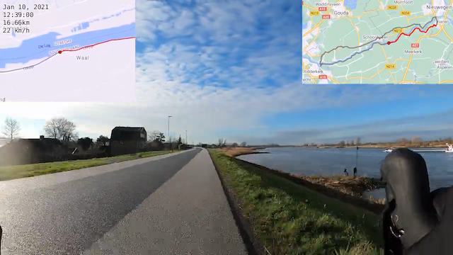

# Syncing a GoPro video with a moving map

## Introduction

This is a set of tools to generate a moving map video that synchronizes **exactly** with GoPro footage. Heavy lifting is performed by [GPX Animator](https://gpx-animator.app/), but `gopro-map-sync` uses other tools such as [gopro2gpx](https://github.com/NetworkAndSoftware/gopro2gpx) and ffmpeg.



[Example video](https://youtu.be/T-CVODzsr_M?t=5), courtesy of Ronald Boer.

`gopro-map-sync` leverages telemetry data (specifically, GPS location) stored in GoPro MP4 files. It can handle footage recorded in GoPro TimeWarp mode. It can optionally reference a GPX file (for example, from a Garmin or Wahoo) file to annotate the video with additional information.

Ideally, it all works out of the box with `gpxmapmovie`; see below for a simple example.

In reality, however, GoPro metadata is sloppy; some tweaking will be required. (See "Common synchronization problems" at the end of this document.)

For that purpose, `gopro-map-sync` provides a number of additional tools to inspect and manipulate GPX files, if necessary. Specifically, `gpxstats ` display a GPX file in human-readable format, `gpxclean ` removes outlier points, `gpxcat` concatenates GPX files, `gpxtac` intelligently reverses a GPX file, `gpxdup` manipulates the start of a GPX file, `gpxshift` intelligently time shifts a GPX file, `gpxhead` displays the first few elements of a GPX file much like UNIX `head`, `gpxtail` displays the last few elements of a GPX file much like UNIX `tail`. Finally, `gpxcomment` is the most complex: it "zips" together a GoPro GPX file with a second GPX file (e.g., from a Garmin or Wahoo) and annotates the GoPro GPX  with `<cmt>` blocks for later consumption by GPX Animator. Most of these tools can be combined together with UNIX pipes.

## Zero installation with Docker

Assuming you have a GoPro video `bikeride.mp4`  in `/Users/john/Movies/`, run:

```bash
docker run --mount="type=bind,source=/Users/john/Movies/,target=/videos/" thomergil/gpxmapmovie \
           --input /videos/bikeride.mp4 \
           --output /videos/movie.mp4
```

The generated video will be at `/Users/john/Movies/movie.mp4`.

## Installation for Mac

```bash
# install dependencies
brew install python@3.9 pipenv ffmpeg cmake

# install gopro2gpx [https://github.com/NetworkAndSoftware/gopro2gpx]
git clone --recurse-submodules git@github.com:NetworkAndSoftware/gopro2gpx.git
cd ./gopro2gpx
cmake .
make

# add gopro2gpx to PATH; or copy to your own PATH
mkdir -f ~/bin/
cp gopro2gpx ~/bin
export PATH=$PATH:/bin/

# install java
brew install adoptopenjdk15

# install GPX Animator [https://github.com/zdila/gpx-animator]
cd ..
git clone git@github.com/zdila/gpx-animator
cd ./gpx-animator
./gradlew assemble

# install gopro-map-sync
cd ..
git clone git@github.com/thomergil/gopro-map-sync
cd ./gopro-map-sync
# On macOs Big Sur (11.0) this prevents python package errors
export SYSTEM_VERSION_COMPAT=1
pipenv install

# test that it works
pipenv run ./gpxmapmovie --help
```

## Installation for Linux

```bash
# TODO: INSTALL adoptopenjdk
# see https://adoptopenjdk.net/installation.html?variant=openjdk15&jvmVariant=hotspot#linux-pkg

echo 'You need to manually install adoptopenjdk; see above'

# install dependencies
sudo apt-get install -y vim python3 git cmake build-essential pipenv ffmpeg

# install gopro2gpx [https://github.com/NetworkAndSoftware/gopro2gpx]
git clone --recurse-submodules git@github.com:NetworkAndSoftware/gopro2gpx.git
cd ./gopro2gpx
cmake .
make
sudo cp gopro2gpx /usr/local/bin/

# install GPX Animator [https://github.com/zdila/gpx-animator]
cd ..
git clone git@github.com:zdila/gpx-animator.git
cd ./gpx-animator
./gradlew assemble

# install gopro-map-sync
cd ..
git clone git@github.com:thomergil/gopro-map-sync.git
cd ./gopro-map-sync
pipenv install

# test that it works
pipenv run ./gpxmapmovie --help
```

## Basic usage

At its simplest, `gpxmapmovie` needs to know the location of the GPX Animator .jar file and one or more MP4 files. For example, to create one map movie from two GoPro videos, `GH0100017.MP4` and `GH0100018.MP4`:


```bash
# You need to replace the -j argument and point
# it at the correct .jar file in the GPX Animator project
pipenv run ./gpxmapmovie -j ~/src/gpx-animator/build/libs/gpx-animator-1.6-all.jar \
    --input GH0100017.MP4 \
    --input GH0100018.MP4 \
    --output movie.mp4
```

The output of this won't be great. The rest of this manual tries to make it better.

## `gpxmapmovie`'s order of operations

`gpxmapmovie` performs the following steps.

1. Collect all GoPro .mp4 and/or .gpx files from the command line or from the `--files` argument (further explained below).
1. If necessary, generate .gpx files from .mp4 files using `gopro2gpx`.
1. Apply `gpxclean` to remove erroneous outlier points. `gpxmapmovie` will exit if more than one consecutive point is an outlier.
1. Optionally post-process .gpx files using user-configurable pipes (see `--files` documentation); for example, `gpxdup` might be used here to pad the start of one or more .gpx files.
1. Concatenate all .gpx files together into one.
1. If `--reference` was used, run `gpxcomment` to annotate each GPX point with information from the reference GPX file (e.g., from a Garmin or Wahoo). This can be used by GPX Animator to generate meaningful information which is displayed in the comment block.
1. Compute the length of the output video and optionally divide that number by the `--divide` argument if you plan to accelerate the GoPro footage.
1. Invoke GPX Animator with the generated .gpx file as `--input` argument, the computed duration as `--total-duration` argument, all arguments from `--args` (if used) and all other unparsed arguments from the `gpxmapmovie`  command as command-line arguments.


##  The `gpxmapmovie` command line

When looking at the `gpxmapmovie` command line it is important to understand that **almost all parameters are passed to GPX Animator**. The only ones that `gpxmapmovie` consumes are: `-j/--jar`, `-f,--files`, `-a,--args`, `-l/--log`, `-r/--reference`, `-i/--input`, and `-z/--force-timezone`. All other command line parameters are passed on to the GPX Animator command line.

The simplest command line requires only `-j` and `--output`and, of course, one ore more input files (with `-i` or `--input`), which can be either .mp4 files or .gpx files. (Note that `-o` is **not** a valid command line parameter, because it is passed on to GPX Animator, which does not accept  `-o`.) Here is an example with .mp4 files.


```bash
gpxmapmovie -j gpx-animator.jar --output output.mp4 -i file1.mp4 [-i file2.mp4 [...]]
```

But you can also pass .gpx files. Note that these need to be .gpx files that were extracted from .mp4 files using `gopro2gpx`. That is the only way to ensure the GoPro footage and the map movie remain synchronized.

```bash
gpxmapmovie -j gpx-animator.jar --output output.mp4 -i file1.gpx [-i file2.gpx [...]]
```

Note that you can not mix .mp4 and .gpx files with `--input` or `-i` on the command line:

```bash
# THIS WILL NOT WORK; CANNOT MIX .mp4 AND .gpx ARGUMENTS; MUST USE --file INSTEAD
gpxmapmovie -j gpx-animator.jar --output output.mp4 -i file1.gpx -i file2.mp4 # <-- BAD
```

If you want to mix .mp4 and .gpx arguments you need to use `--file`; see below.

If you want `gpxmapmovie` to infer the correct time and speed from another GPX file (for example, made by a Garmin or Wahoo), you can pass `--reference` to that file. For example:

```bash
gpxmapmovie -j gpx-animator.jar --reference wahoo.gpx --output output.mp4 -i file1.mp4
```

Finally, if you cross a timezone and you want the reported time to always be correct, you can pass the `--force-timezone` option. `gpxmapmovie`'s default behavior is to only look up the timezone of the first GPX point and apply that to all subsequent GPX points.

Note that **this will make the gpxcomment stage very slow** as a timezone lookup occurs for each point.

```bash
gpxmapmovie -j gpx-animator.jar --reference wahoo.gpx --force-timezone --output output.mp4 -i file1.mp4
```

For convenience you can set `GPXMAPMOVIE_JAR` instead of using `--jar`:

```bash
export GPXMAPMOVIE_JAR=~/src/gpx-animator/build/libs/gpx-animator-1.6.0-SNAPSHOT-all.jar
gpxmapmovie --output output.mp4 -i file1.mp4 [-i file2.mp4 [...]]
```

## Passing additional arguments to GPX Animator via `gpxmapmovie`'s command line

Any command line parameter **not** consumed by `gpxmapmovie` is passed to GPX Animator. In the following example, only `-j` and `--input` are consumed by `gpxmapmovie`; all other arguments are passed to the GPX Animator command line.

```bash
pipenv run ./gpxmapmovie -j path/to/gpx-animator.jar \
   --tms-url-template 'http://mt1.google.com/vt/lyrs=m&x={x}&y={y}&z={zoom}' \
   --background-map-visibility 1.0 \
   --viewport-height 640 \
   --viewport-width 640 \
   --tail-duration 10000 \
   --pre-draw-track \
   --pre-draw-track-color '#808080' \
   --attribution-position hidden \
   --information-position hidden \
   --comment-position 'bottom left' \
   --input GH0100017.MP4 \
   --input GH0100018.MP4 \
   --output movie.mp4
```

## Passing GPX Animator command line options using `--args`

In the example above, the command line gets awkwardly long. You can put GPX Animator command line arguments in a file and pass it to `gpxmapmovie` with `--args`.

`args.txt`:

```bash
#
# Command line options for GPX Animator.
#
# Empty lines and lines starting with # are ignored
#
--tms-url-template 'http://mt1.google.com/vt/lyrs=m&x={x}&y={y}&z={zoom}'
--background-map-visibility 1.0
--viewport-height 640
--viewport-width 640
--tail-duration 10000
--pre-draw-track
--pre-draw-track-color '#808080'
--attribution-position hidden
--information-position hidden
--comment-position 'bottom left'
--output output.mp4
```

Then invoke `gpxmapmovie` with an `--args` argument:

```bash
# You need to replace the -j argument and point
# it at the .jar file in the GPX Animator project
pipenv run ./gpxmapmovie -j /path/to/gpx-animator.jar \
                         --args args.txt \
                         --input GH0100017.MP4 \
                         --input GH0100018.MP4
```

There are some sample argument files in the project's [samples/](https://github.com/thomergil/gopro-map-sync/tree/main/samples) subdirectory.

## Advanced usage: using  `--files` to list MP4 files

Sometimes you need to pass many .MP4 files to `gpxmapmovie` and it becomes
easier to create a file with filenames in it.

```
#
# contents of files.txt
#
# Empty lines and lines starting with # are ignored
#
./GH0100017.MP4
./GH0100018.MP4
```

Then invoke `gpxmapmovie` as follows:

```bash
# You need to replace the -j argument and point
# it at the .jar file in the GPX Animator project
pipenv run ./gpxmapmovie -j path/to/gpx-animator.jar \
                         --args args.txt \
                         --files files.txt
```

## Advanced usage: using  `--files` to use custom GPX files

Sometimes the output of `gopro2gpx` is not good enough and you need to manipulate it. You can tell `gpxmapmovie` to use a custom .GPX file. For example, if you have a file `GH0100017-custom.gpx` which you manipulated to better synchronize with `GH0100017.MP4`, you can specify it in the second column. `gpxmapmovie` will use that file rather than the output of `gopro2gpx`.

```
#
# contents of files.txt
#
# Empty lines and lines starting with # are ignored
#
./GH0100017.MP4 GH0100017-custom.gpx
./GH0100018.MP4
```

## Advanced usage: using  `--files` to manipulate GPX files

Sometimes the output of `gopro2gpx` requires only a small fix. For example, my GoPro Hero 8 Black consistently drops the first 2 points in a GPX track when in TimeWarp Auto mode. `gpxdup` can fix that problem by duplicating the first point. Rather than running `gpxdup` manually and storing the result in a file, you can tell `gpxmapmovie` to run `gpxdup` on the output of `gopro2gpx`. If the second column starts with a pipe ( `|`), the rest of the line defines one or more functions to perform on the output of `gopro2gpx`.

```
#
# contents of files.txt
#
# Empty lines and lines starting with # are ignored
#
./GH0100017.MP4 | gpxdup, duplicate=2
./GH0100018.MP4 | gpxdup, duplicate=1
```

Any of the functions in `gpxlib.py` can be invoked using this mechanism. (They are explained below.) Multiple commands can be piped. The follow example is functionally equivalent to the previous example.

```
#
# contents of files.txt
#
# Empty lines and lines starting with # are ignored
#
./GH0100017.MP4 | gpxdup, duplicate=1 | gpxdup, duplicate=1
./GH0100018.MP4 | gpxdup, duplicate=1
```

## Advanced usage: combine with a "real" GPX file

GPX data extracted from GoPro MP4 with `gopro2gpx` synchronizes well with GoPro footage, but GPX Animator will not know the correct speed and time, especially if footage was shot in TimeWarp mode. `gpxmapmovie` can "reconstruct" the correct information by copying it from another GPX file with the `--reference` argument. For example:

```bash
# You need to replace the -j argument and point
# it at the .jar file in the GPX Animator project
pipenv run ./gpxmapmovie -j path/to/gpx-animator.jar \
                         --args args.txt \
                         --files files.txt \
                         --reference wahoo.gpx
```

This process of "annotating" data is messy and imperfect, especially as GoPro footage is interrupted (for example, for battery changes) and the Garmin or Wahoo pauses when standing still.

Under the hood, `gpxcomment` annotates the GPX by adding a `<cmt>` block to each GPX track point, which GPX Animator consumes using the `--comment-position` argument.

## Using `--files`, `--args` , `--reference` with `--path` or `GPXMAPMOVIE_PATH`

All arguments for `--files`, `--args-`, and `--reference` should either be absolute paths or relative to the current directory. You can use `--path` (or set `$GPXMAPMOVIE_PATH`) with relative paths for `--files`, `--args`, and `--reference`, in which case those paths are relative to `--path` (or `$GPXMAPMOVIE_PATH`).

## Advanced usage: using `--files`, `--args` , `--reference` with Docker

Docker images cannot access files on your disk unless you mount the containing folder with `--mount`. Let's say one or more movies are stored in `/Users/john/Movies/` . In addition, files to be used as `--files` and `--args ` and `--reference` are stored `/Users/john/save/`. We need to mount both of these directories as part of the `gpxmapmovie` invocation.

Note, this may be **slow**:

```bash
# this may be slow if there is a lot of content in /Users/john/Movies!
docker run \
  --mount="type=bind,source=/Users/john/Movies/,target=/videos/" \
  --mount="type=bind,source=/Users/john/save/,target=/data/" \
  -t gpxmapmovie:latest \
  --log info \
  --files /data/2020-08-17.txt \
  --args /data/args.txt \
  --divide 4 \
  --reference /data/2020-08-17.gpx \
  --output /videos/movie.mp4
```

Output will be written to `/Users/john/Movies/movie.mp4`.

Note that `2020-08-17.txt` needs to reference MP4 files as if they were located in `/videos`, since that is where we told Docker to mount the directory.

`2020-08-17.txt`:

```
/videos/2020-08-17-01.mp4
# skip 2020-08-17-02.mp4
/videos/2020-08-17-03.mp4 | gpxdup, duplicate=3, shift=0
/videos/2020-08-17-04.mp4 | gpxdup, duplicate=1, shift=0
```

If you get a `java.lang.OutOfMemoryError: Java heap space` error, you may need to extra RAM resources for Docker.

## Additional tools/functions in `gopro-map-sync`

These tools are available on the command line, but also as functions that you can invoke in `--files`.

### `gpxcat`: concatenate files

In its simplest forms, `gpxcat` concatenates multiple GPX files together.

```bash
pipenv run ./gpxcat file1.gpx file2.gpx
```

The result is files `file1.gpx`  followed by `file2.gpx`.

However, there is likely a timestamp gap between the end of `file1.gpx` and the start of `file2.gpx`. The `--killgap` smoothes that out.

```bash
pipenv run ./gpxcat --killgap file1.gpx file2.gpx
```

`gpxcat` tracks the average gap between timestamps and uses that to fill in the gap between `file1.gpx` and `file2.gpx`.

This can be used combined with `--gaplength SECS` to add a number of seconds (**in addition** to the computed average) between the last point of `file1.gpx` and the first point of `file2.gpx`.

```bash
pipenv run ./gpxcat --killgap --gaplength 10 file1.gpx file2.gpx
```

If footage was shot with TimeWarp 10x or 15x (not Auto!), then all gaps can be multiplied to "reconstruct" the original timestamps. Again, this does **not work with TimeWarp Auto**.

```bash
pipenv run ./gpxcat --killgap --stretch 10 file1.gpx file2.gpx
```

This multiplies the length of each time gap by 10x.

### `gpxtac`: invert GPX points

In its simplest form, `gpxtac` inverses all points in a file:

```bash
pipenv run ./gpxtac file1.gpx
```

However, this also inverts timestamps, meaning that time will appear to go backwards. To invert just GPS locations, but not timestamps, use `--time`:

```bash
pipenv run ./gpxtac --time file1.gpx
```

### `gpxhead` and `gpxtail`

Like, UNIX `head` and `tail`, both take a numeric flag to indicate the number of lines at the start/end of the file to display:

```bash
pipenv run ./gpxhead -20 file.gpx
pipenv run ./gpxtail -5 file.gpx
```

### `gpxclean`: remove outliers

Removes outlier points.

```bash
pipenv run ./gpxclean file.gpx
```

If you expect more than 1 consecutive points to be outliers, you can specify it with `--tolerance`:

```bash
pipenv run ./gpxclean --tolerance 3 file.gpx
```

You can change the default distance that is considered an outlier, using `--distance METERS`.

```bash
pipenv run ./gpxclean --distance 400 file.gpx
```

Any single point 400+ meters removed from the previous point is removed.

### `gpxdup`: duplicate the first GPX point

Duplicates the first point in a GPX file. It can shift duplicated points laterally (with `--shift`, in units of 1/100000 latitude) and in time (with `--time`).

```bash
pipenv run ./gpxdup --duplicate 1 --shift 0 --time 400 file.gpx
```

This duplicates the first point, in the same physical location, but 400ms earlier than the first point.

`gpxdup` can remove points before duplicating (what will become) the first point. It can either remove a fixed number of points (with `--strip`) or it can read another GPX file (for example, from Garmin or Wahoo) and remove all points that are more than a certain distance away from the first point from that alternative GPX.

For example, to remove all points more than 200m away from the first point in a GPX file `reference.gpx`, and to then duplicate the same number of points as were removed:

```bash
pipenv run ./gpxdup --smart-strip reference.gpx --smart-strip-radius 200 --smart-duplicate file.gpx
```

### `gpxshift`: time shift all GPX points

Time shifts all points in a GPX file. The shift can be relative (negative or positive). It can also be an absolute start time or end time.

Relative value is in milliseconds. For example, to time shift all GPX points 20 seconds forward in time (i.e, later):

```bash
pipenv run ./gpxshift +20000 file.gpx
```

To time shift all GPX points 500 milliseconds backwards in time (i.e, earlier):

```bash
pipenv run ./gpxshift -500 file.gpx
```

To set the first timestamp to `2021-01-02T14:33:45.462000Z`:

```bash
pipenv run ./gpxshift '2021-01-02T14:33:45.462000Z' file.gpx
```

The set the last timestamp to `2021-01-02T14:33:45.462000Z`:

```bash
pipenv run ./gpxshift --last '2021-01-02T14:33:45.462000Z' file.gpx
```

### `gpxcomment`: annotate a GoPro GPX file with data from another GPX file

Ingests one or more GoPro GPX files and an additional GPX file (with `--reference`) that came from a "real" tracking device, such as a Wahoo or Garmin. The result is a GoPro GPX file with a `<cmt>` block on each GPX point that can be consumed by GPX Animator for the `--comment-position` functionality.

For example, to annotate `file.gpx` with data from `wahoo.gpx`:

```bash
pipenv run ./gpxcomment --reference wahoo.gpx file.gpx
```

### `gpxstats`: human readable GPX

To inspect a GPX file:

```bash
pipenv run ./gpxstats file.gpx
```

Visual tools are better suited for this, however.

## Common synchronization problems and solutions

There are common problems that cause GoPro footage and map video to be out of sync. Here is a list of common problems and solutions.

#### The footage is immediately out of sync

The GoPro takes a while to obtain a GPS lock. Until it does, it either does not record any GPX points or it records wildly inaccurate GPX points. Use a visual GPX editor or `gpxdup` and/or `gpxshift` to remove those points and/or (re)insert them. When editing, make sure timestamps remain smooth relative to the rest of the file.

The first time you turn on a GoPro to record footage, it is advisable to turn it on, let it obtain GPS lock for a few minutes. Record a 60-second video. Turn it off. It is now ready for use.

#### **The footage gets out of sync**

This happens on boundaries between MP4 files. My GoPro HERO 8 Black consistently drops 2 GPX points at the start of each movie. In the `--files` examples above you can see frequent examples of `| gpxdup, duplicate=2` to duplicate the first GPX point twice (for a total of 3 points) to smooth out this problem.

#### The map movie gets ahead of the GoPro footage

This means GPX points are missing at the start of the file. Use `gpxdup, duplicate=N` in the `--files` file argument to duplicate points at the start of the GPX file. Start with N=1 or N=2.

#### **The map movie lags behind the GoPro footage**

This means there are too many GPX points at the start of the file. Use `gpxdup, strip=N` in the `--files` file argument to strip points from the start of the GPX file. Start with N=1 or N=2.

#### After tweaking `strip` and `duplicate`, synchronization still is not perfect

Each strip/duplicate adds 400ms. You can fine-tune, by setting `duplicate=1` and then tweaking `time`. For example:

```
2020-08-19-01.mp4 | gpxdup, duplicate=1, shift=0, time=1200
2020-08-19-02.mp4 | gpxdup, duplicate=1, shift=0, time=700
2020-08-19-03.mp4 | gpxdup, duplicate=1, shift=0, time=200
```

If the GoPro footage is **ahead**, then **increase** the `time` value.
If the GoPro footage lags **behind**, then **decrease** the `time` value.

Obviously, if `time` is less than 0, you'll need to use `strip` as well. Recall that `strip` is applied before `duplicate` is applied. In other words `strip=2`, `duplicate=1` means that the first 2 points from the GPX track are removed, and the third point (which becomes the first point) is duplicated.

#### **There is a crazy outlier point that screws everything up**

Run the GPX file through `gpxclean`. Usually it's a single outlier point, but sometimes it's more, in which case you need to set `--tolerance` to a higher number.

#### It crashes

Please file an issue! Thank you.

### Other projects

* [GPX Animator](https://gpx-animator.app/), an excellent tool originally written by [Martin Ždila](https://github.com/zdila), currently maintained by [Marcus Fihlon](https://github.com/McPringle).

* https://github.com/JoanMartin/trackanimation, a similar tool as GPX Animator.

* Compare GPX tracks using the Needleman-Wunsch algorithm ([explained](https://steemit.com/programming/@bitcalm/how-to-compare-gps-tracks)): https://github.com/jonblack/cmpgpx.

* https://github.com/remisalmon/gpx_interpolate, a tool that interpolates GPX points in a sparse GPX track.

* https://github.com/JuanIrache/gopro-telemetry (code that runs https://goprotelemetryextractor.com/free/), a tool similar to `gopro2gpx`, but not suitable for this project because it does not work correctly for TimeWarp'd footage.

* [GPX Editor](https://apps.apple.com/nl/app/gpx-editor/id924782627?mt=12), a tool to manipulate GPX files for Mac. I don't love it, but it does the job.
